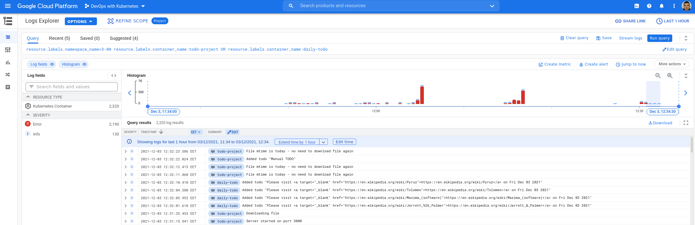

##### Part 0

```shell
docker build -t kubernetes-school .
docker run --rm -it -p 8001:3005 -v /var/run/docker.sock:/var/run/docker.sock -v "$PWD":/opt -v "$PWD"/.config/.config:/root/.config/gcloud -v "$PWD"/.config/.kube:/root/.kube kubernetes-school bash
```

Then inside Docker container

```shell
HOST_IP=`ip -4 route show default | cut -d" " -f3`
k3d cluster create --port 8082:30080@agent:0 --port 8081:80@loadbalancer -a 2 --k3s-arg "--tls-san="$HOST_IP"@server:0"
docker exec k3d-k3s-default-agent-0 mkdir -p /tmp/kube
sed -i 's/https:\/\/0.0.0.0/https:\/\/'"$HOST_IP"'/' /root/.kube/config
kubectl cluster-info
helm repo add prometheus-community https://prometheus-community.github.io/helm-charts
helm repo add stable https://charts.helm.sh/stable
kubectl create namespace prometheus
helm install prometheus-community/kube-prometheus-stack --generate-name --namespace prometheus \
  --set grafana.ingress.enabled=true \
  --set grafana.ingress.path=/grafana \
  --set grafana.'grafana\.ini'.server.root_url=http://0.0.0.0:3000/grafana \
  --set grafana.'grafana\.ini'.server.serve_from_sub_path=true
helm repo add grafana https://grafana.github.io/helm-charts
helm repo update
kubectl create namespace loki-stack
helm upgrade --install loki --namespace=loki-stack grafana/loki-stack
k9s
```

##### Part 1

1.01, 1.03 - hash-generator  
1.02, 1.04, 1.05, 1.06, 1.08, 1.12, 1.13 - todo-project  
1.07, 1.10, 1.11 - log-output  
1.09 - ping-pong

##### Part 2

2.01, 2.03, 2.06 - log-output  
2.02, 2.04, 2.08, 2.09, 2.10 - todo-project  
2.07 - ping-pong

##### Part 3

```shell
gcloud auth login
gcloud config set project devops-with-kubernetes-291121
gcloud services enable container.googleapis.com
gcloud container clusters create dwk-cluster --zone=europe-north1-b --release-channel=rapid --cluster-version=1.22
# Do something
gcloud container clusters delete dwk-cluster --zone=europe-north1-b
```

3.01, 3.02, 3.09 - ping-pong  
3.03, 3.04, 3.05, 3.08 - todo-project

###### Exercise 3.06

**DBaaS vs DIY**

* Setup (DBaaS = DIY)

  Setup of DBaaS looks like a simple choice of an image. But in real life it could be a bit more painful when it comes
  to configuration of networking. On the other hand modern databases are almost production ready, and it is not a
  problem to set up new database.
* Configuration (DBaaS < DIY)

  Here I'd give a win to DIY databases. You have the full power and can configure everything like you want. DBaaS are
  pretty closed in this meaning. From top of my head - there is a problem with max_connections in PostgreSQL that you
  cannot change it without changing machine type (and therefore increased costs) and have to use PgBouncer, e.g.
* Backup and maintenance overall (DBaaS > DIY)

  It is so easy to make backups and restore database in DBaaS in comparison with DIY. Even if dumps are easy to create
  in DIY then you still have a question where to store them, how to restore easily etc.
* Price (DBaaS < DIY)

  At the first glance DBaaS is much more expensive. I took a look at our last month invoice in one project. We paid €124
  for very simple instance of Google Cloud SQL. Early in this course we saw that for that money one can buy 6 nodes
  1vCPU each. I understand that database is not just CPU but also RAM and disk and networking. But still DIY looks
  cheaper than DBaaS.

* Log and monitoring (DBaaS > DIY)

  Since Cloud SQL is the part of big Cloud family then it is easier to set up logging and monitoring (in most cases it
  works out of the box). This is not a big problem for DIY but still requires more efforts.

As usual the choice between DBaaS and DIY is a matter of each particular case. And the correct choice depends on many
factors besides aforementioned.

###### Exercise 3.07

I have both options (Cloud SQL and DIY PostgreSQL) at my current job. And my choice for this course is DIY PostgreSQL.
It is more interesting to work and learn StatefulSet and PVC. It is more useful for learning k8s manifests. It is
cheaper for such small projects. It doesn't require all cool stuff that Cloud SQL provides.

###### Exercise 3.10

Enabled Google Cloud Logging and Google Cloud Monitoring.

